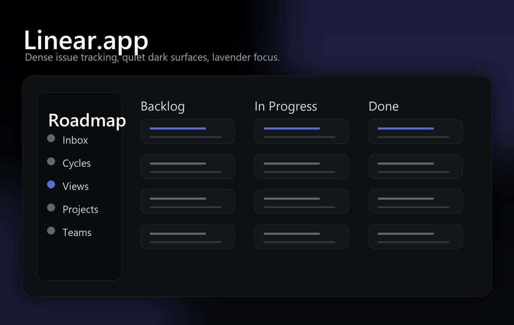
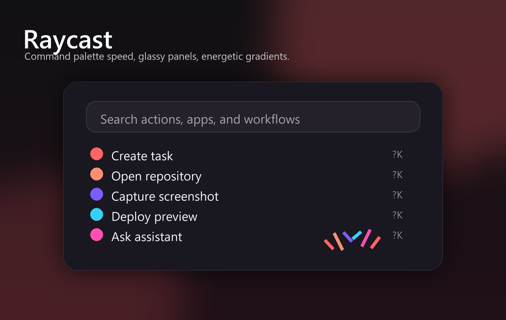
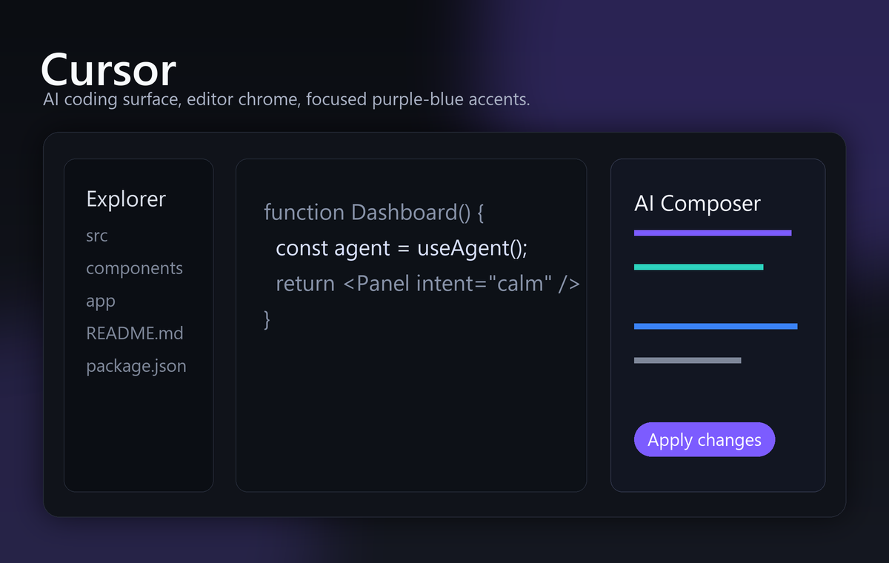
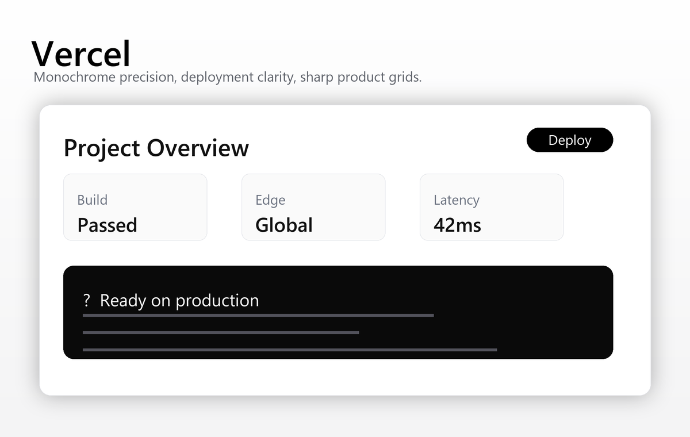
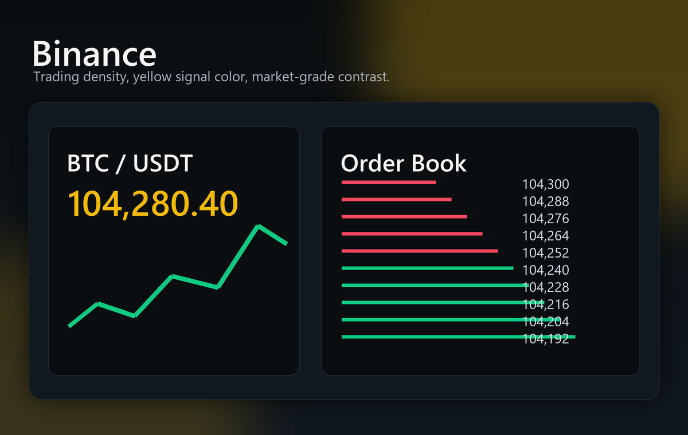
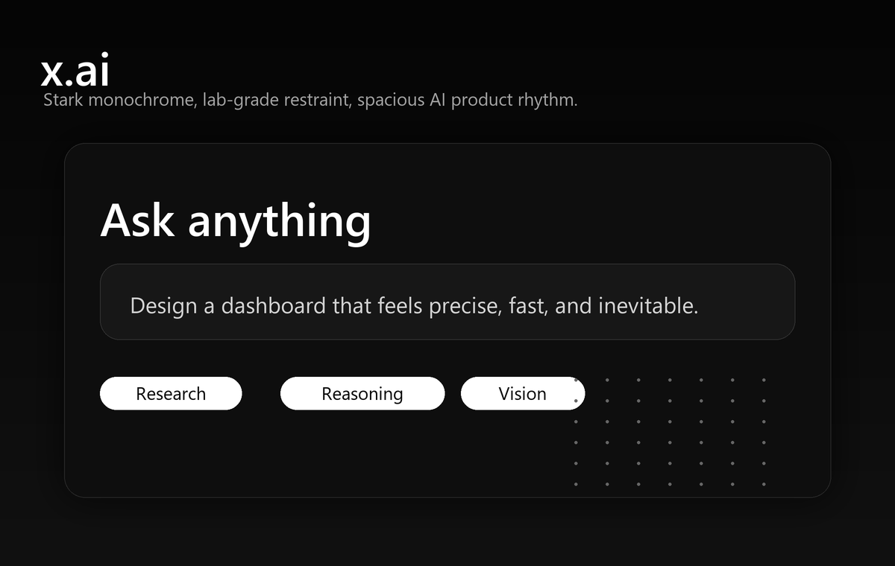

# Awesome Design MD Skill

## 来源说明

本项目基于开源的 [Awesome DESIGN.md](https://github.com/VoltAgent/awesome-design-md) 资料库整理而来。原资料库收集了大量面向 AI 编程与 UI 生成场景的 `DESIGN.md` 设计风格文档，涵盖 Linear、Raycast、Cursor、Vercel、Coinbase、Binance、x.ai 等多种产品风格。

最初，这些资料主要是一组可以手动复制到项目里的 `DESIGN.md` 文档。奶牛叔在此基础上将它封装成更方便使用的 Skill 版本：把风格索引、选择规则和完整 `design-md` 设计库放在同一个 Skill 中。安装后，AI Agent 可以根据你的产品场景自动选择合适风格，只读取对应的 `DESIGN.md`，再用于前端设计、页面美化和 UI 重构任务。

简单说：这是一个把 Awesome DESIGN.md 资料库变成「可直接被 AI Agent 调用的 UI 设计 Skill」的版本。

## 风格预览

下面是几个典型风格的示意预览图，方便快速理解这个 Skill 能覆盖的 UI 方向。图片是基于对应风格规范生成的视觉示意，不是官网截图。

| Linear.app | Raycast | Cursor |
| :---: | :---: | :---: |
|  |  |  |

| Vercel | Binance | x.ai |
| :---: | :---: | :---: |
|  |  |  |

## 这个 Skill 能做什么

- 在用户提出「设计 UI」「美化页面」「改成大厂风格」「使用 DESIGN.md」等需求时自动触发。
- 根据产品类型选择合适的风格，而不是默认套用某一种风格。
- 从 `design-md/<style>/DESIGN.md` 中只读取当前需要的风格规范，节省上下文。
- 辅助 AI Agent 生成更稳定、更有参考依据的前端页面和组件设计。

## 安装方式

把本仓库克隆到你的 skills 目录，目录名保持为 `awesome-design-md`。

Windows PowerShell:

```powershell
git clone https://github.com/wearescientist/awesome-design-md "$env:USERPROFILE\.codex\skills\awesome-design-md"
```

macOS / Linux:

```bash
git clone https://github.com/wearescientist/awesome-design-md ~/.codex/skills/awesome-design-md
```

安装后，如果你的 Agent 不会自动重新加载 skills，请重启当前 Agent 会话。

## 使用方式

安装完成后，正常提出 UI 需求即可，例如：

```text
帮我把这个后台页面按大厂风格美化一下
```

```text
Use Awesome Design MD and redesign this dashboard.
```

```text
这个页面想要 Linear / Raycast / Cursor 那种感觉，帮我重构 UI。
```

Agent 会先选择合适的风格，再读取对应的 `DESIGN.md`，然后把它用于当前项目的 UI 设计或前端改造。

## 工作方式

这个 Skill 采用渐进式读取：

1. 先通过 `SKILL.md` 判断是否需要使用 Awesome Design MD。
2. 如需选择风格，读取 `STYLE_INDEX.txt` 或 `references/style-selection.md`。
3. 只读取一个最合适的 `design-md/<style>/DESIGN.md`。
4. 将该风格用于布局、颜色、字体、间距、交互状态和组件质感设计。

这样可以避免一次性把整个设计库塞进上下文，也能避免 AI 盲目套用单一风格。

## 目录结构

```text
SKILL.md                         # Skill 入口与触发规则
STYLE_INDEX.txt                  # 可用风格索引
design-md/<style>/DESIGN.md      # 各风格的设计规范
references/style-selection.md    # 风格选择补充说明
agents/openai.yaml               # Skill 展示元数据
assets/previews/                 # README 风格预览图
```

## 注意事项

- 本仓库根目录就是 Skill 根目录。
- `SKILL.md` 使用相对路径，克隆到其他机器后也能正常使用。
- 不建议一次性读取整个 `design-md/` 目录；应按任务选择一个风格后再读取。
- 这是为了方便 AI Agent 使用而整理的 Skill 版本，不替代原始 Awesome DESIGN.md 资料库。

## License

See [LICENSE](LICENSE).